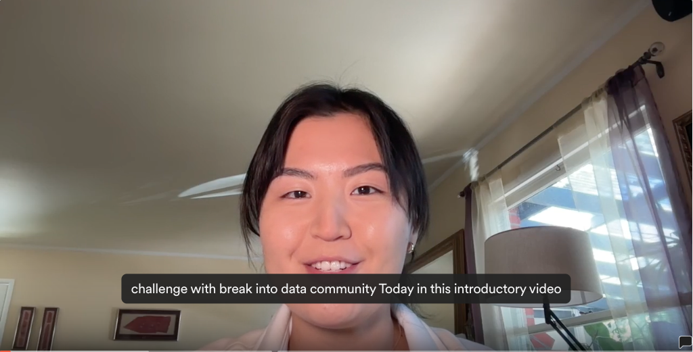

# Introduction to 30-Day ML Challenge May 2024

  

## 🏆 Competition Structure

Form a team (2-6 members) and dive into the competition, where your projects will be evaluated based on [these criteria](link to the criteria). Top three projects will earn the winners' spotlight.

Standout submissions that is beneficial to the members of the community of Data Professionals we will be featured on our socials!

🌟 Open Category: Not part of a team? No worries! Individuals outside the formal teams can still submit projects. Standout submissions that provide significant value to our Data Professionals community will also be featured.

## 📚 Resources

To support your journey through the challenge, we've compiled a comprehensive list of resources:

- [YouTube](https://www.youtube.com/channel/UCv9TSSXw9SVWdQreJo2ZU_Q): Stream tutorials and insights.
- [Substack](https://breakintodata.substack.com/about): Follow our newsletter for updates and tips.
- [LinkedIn](https://www.linkedin.com/company/break-into-data/): Connect with peers and share your progress.
- [Discord](https://discord.gg/G6wwZXrFPB): Join real-time discussions and collaboration.
- Google Docs: Access detailed documentation and guides.

Gear up for a transformative experience that sharpens your skills and expands your network within the data world!
