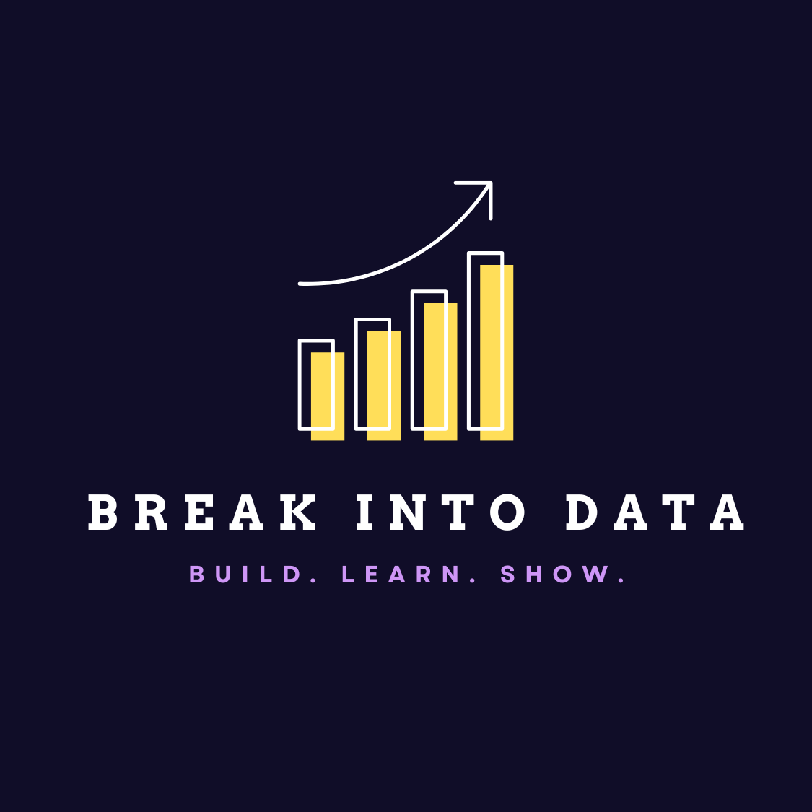

# 30-Day-ML Challenge

    

## 🌟 Getting Started

Welcome to the 30-Day ML Challenge hosted by Break into Data! This GitHub repository serves as your central hub, providing all the necessary details for participation in this event. Engage with our data community through a series of exciting, hands-on projects designed to boost your data skills.

* _Sign up form? (to grab their emails)_
* Join our [Discord](https://discord.gg/G6wwZXrFPB) and get active on the `🏆 30-DAY-ML-CHALLENGE` channel group
* The challenge begins on May 1st, but you can start engaging with the community right away!
* Follow [this spreadsheet](https://docs.google.com/spreadsheets/d/13fsOcgX6VtGpLcjl9-h3xL3e3ym4q0uROEUbrlT38eE/edit#gid=0) for guidance.

### Learning at Your Own Pace

You can take the course at your own pace. All the materials are freely available, and you can start learning at any time.

To take the best out of this course, we recommend this:

* Join our [Discord](https://discord.gg/G6wwZXrFPB)
* Each topic is contained within its own folder, complete with resources and README.md files for easy navigation.
* Watch the videos and read articles from [this Google Sheets file](https://docs.google.com/spreadsheets/d/13fsOcgX6VtGpLcjl9-h3xL3e3ym4q0uROEUbrlT38eE/edit#gid=0).
* If you have any questions, ask them in the `#support` channel in Discord.
* Do at least a simple project. Only this way you can make sure you're really learning and participating in the challenge.
* If you need feedback, use the `#guide` channel

Of course, you can take each module independently.

## 🛠️ Prerequisites

* Python Skills: Comfort with Python, ranging from basic syntax to intermediate applications.
* Command Line Proficiency: Familiarity with basic command line operations.
* Project Experience: Prior experience with project development will help you maximize your learning.

## 📚 Resources

To support your journey through the challenge, we've compiled a comprehensive list of resources:

* [YouTube](https://www.youtube.com/channel/UCv9TSSXw9SVWdQreJo2ZU_Q): Stream tutorials and insights.
* [Substack](https://breakintodata.substack.com/about): Follow our newsletter for updates and tips.
* [LinkedIn](https://www.linkedin.com/company/break-into-data/): Connect with peers and share your progress.
* [Discord](https://discord.gg/G6wwZXrFPB): Join real-time discussions and collaboration.

## ❓ Asking questions

Have queries? Don't hesitate to reach out:

Get ready to enhance your machine learning skills with a community of enthusiastic learners and seasoned experts!